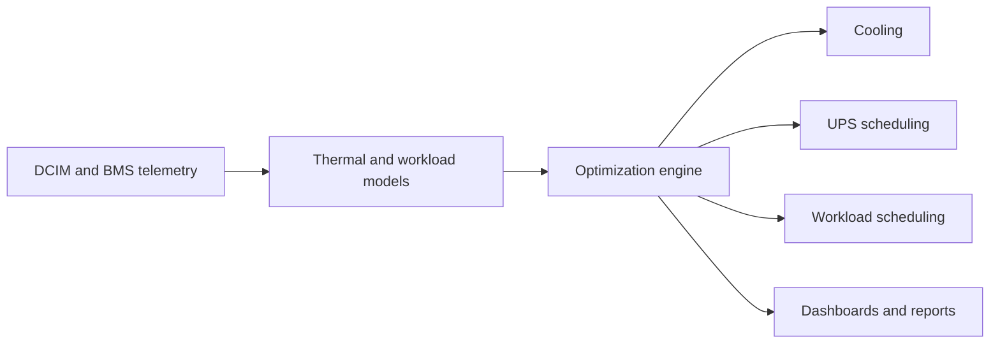

<h1 align="center">Kerim Lihić</h1>

  Tech Lead at <a href="https://www.voltium.ai">VoltiumAi</a> · Systems engineer · Security researcher

  
  
  
  

I build software close to the machine: hypervisor-assisted tracers, Windows kernel
experiments, low-latency graphics, security tooling, and AI systems with explicit
capability boundaries.

## ⚡ Currently: VoltiumAi

I am the Tech Lead at [VoltiumAi](https://www.voltium.ai), a Sarajevo startup building
AI-powered energy optimization for data centers. I lead technical direction and product
engineering across the platform.

VoltiumAi connects to existing DCIM and BMS infrastructure, learns thermal and workload
patterns, then optimizes cooling, UPS usage, and workload scheduling. The goal is to
reduce energy waste, operating cost, and carbon output without replacing existing data
center hardware.

## Selected engineering

| Project | What makes it interesting |
|---|---|
| [**SvmTrace**](https://github.com/ntkrnlmp/svmtrace) | AMD SVM tracer that uses NPT execute faults and intercepted `#DB` exits to capture RIP, RFLAGS, CR3, and 16 GPRs after each instruction |
| [**DComp Overlay**](https://github.com/ntkrnlmp/dcomp-overlay) | D3D11 and DirectComposition overlay DLL manually mapped into `explorer.exe`, with measured render and presentation timing |
| [**VirusShare SDK**](https://github.com/ntkrnlmp/virusshare) | Typed Python SDK and CLI for search, metadata, bounded downloads, and archive inspection |
| [**mapped_explorer**](https://github.com/ntkrnlmp/mapped_explorer) | Windows kernel experiment for finding executable memory outside reported loaded-module ranges |
| [**Excel AI Assistant**](https://github.com/ntkrnlmp/excel-ai-assistant) | Office.js add-in where model actions pass through a named capability policy and confirmed workbook writes |
| [**Anidakapo Studio**](https://github.com/ntkrnlmp/anidakapo-studio) | Interactive 3D web experience built with Next.js, React Three Fiber, Three.js, and GSAP |

## Toolchain

  
  
  
  
  
  

Windows SDK and WDK · WinDbg · Ghidra · CMake · Office.js · Direct3D 11

Based in Bosnia and Herzegovina.
